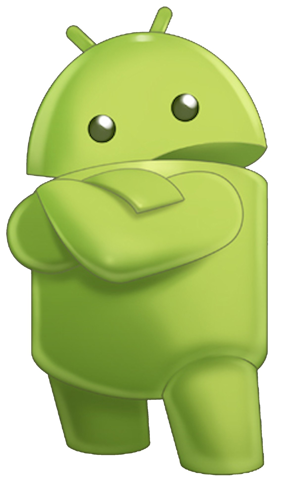

# Привет, я [Ваше Имя]! 👋

Я разработчик программного обеспечения с увлечением к [ваши интересы, например: веб-разработке, машинному обучению и т.д.]. Моя цель — создавать инновационные и эффективные решения для реальных задач.

## 🌱 Мои навыки
- Языки программирования: [Python, JavaScript, C++, и т.д.]
- Веб-технологии: [HTML, CSS, React, Node.js, и т.д.]
- Базы данных: [MySQL, MongoDB, PostgreSQL, и т.д.]
- Инструменты: [Git, Docker, и т.д.]

## 🚀 Мои проекты
- **[Проект 1](ссылка на проект 1)**: Краткое описание проекта и его целей.
- **[Проект 2](ссылка на проект 2)**: Краткое описание проекта и его целей.
- **[Проект 3](ссылка на проект 3)**: Краткое описание проекта и его целей.

## 📫 Связь со мной
- [LinkedIn](ссылка на LinkedIn)
- [Twitter](ссылка на Twitter)
- [Email](mailto:ваш_email@example.com)

## 📄 Резюме
Вы можете ознакомиться с моим резюме [здесь](ссылка на резюме).

## 🎉 Интересные факты
- Я увлекаюсь [ваши увлечения, например: путешествиями, чтением, спортом и т.д.].
- Я изучаю [что-то новое, например: новый язык программирования, технологии и т.д.].

Спасибо за посещение моего профиля! 😊
